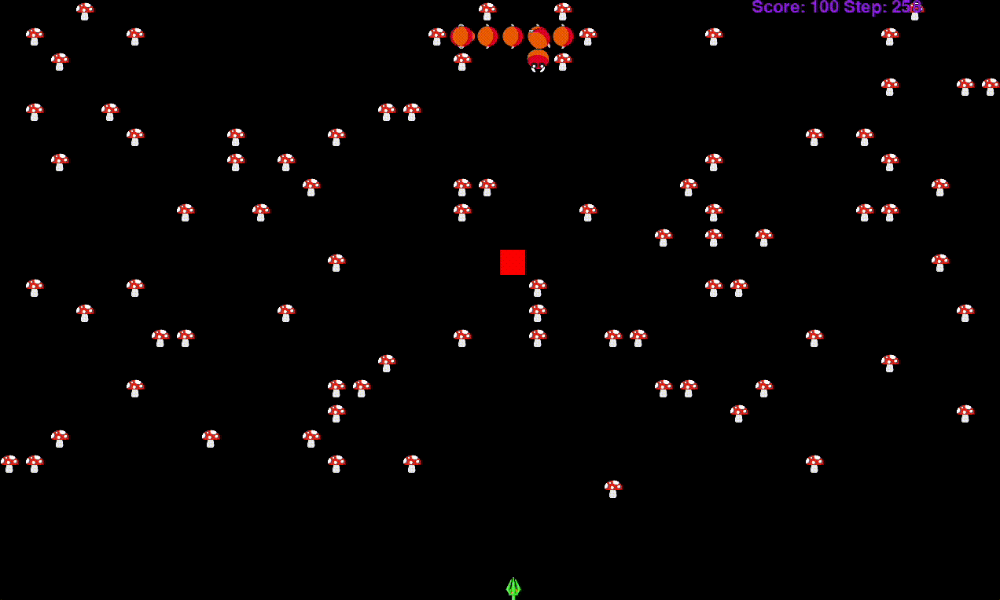

[](https://classroom.github.com/a/63eybip2)
# ia-centipede
Clone of Arcade Centipede for AI classes



# How to run ?
*HINT:* Create a virtual environment prior to installing the requirements.txt

1st start the server:
```
python3 server.py
```

Optionally start the viewer
```
python3 viewer.py
```

Lastly start the client (can be student.py)
```
python3 client.py
```
