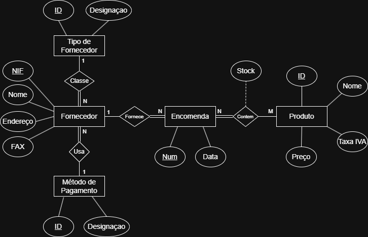
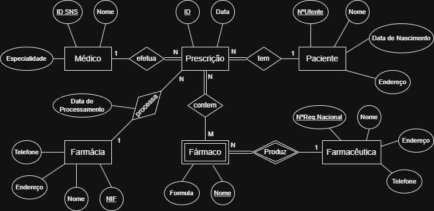
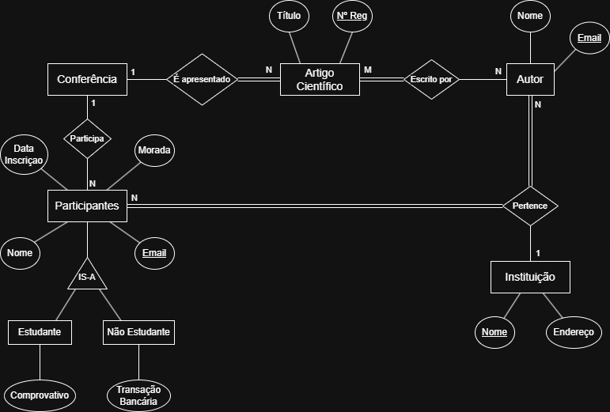
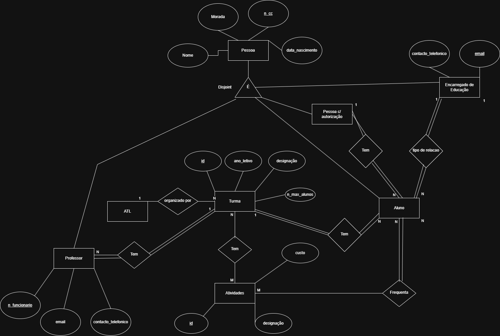
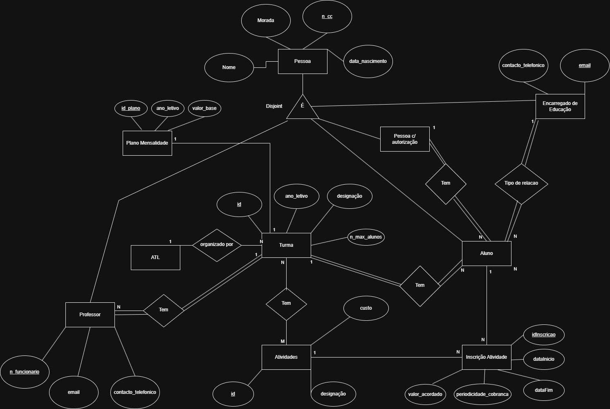

# BD: Guião 2

## Template para respostas ao guião da aula 2.
Template for submission of answers to "aula 2" guide.

## Perguntas / Questions

### Problema *2.1*

Considere um Sistema de Gestão de Stocks de uma empresa. O presente exercício propõe-se modelar a parte das encomendas desse sistema de informação segundo as seguintes premissas: 
* A empresa comercializa vários produtos que são caracterizados por um código, nome, preço e taxa de IVA; 
* Devemos saber a cada momento o número de unidades de cada produto em armazém; 
* Uma encomenda é caracterizada pelo número de encomenda, a data em que foi realizada e um fornecedor único. Uma encomenda contém um ou mais itens (i.e. produtos) e respetivas unidades; 
* Cada fornecedor é caracterizado por um nome, número de informação fiscal, endereço, número de fax, condições de pagamento (pronto, 30 dias, 60 dias, etc) e um código interno do tipo de fornecedor (ao qual está, por sua vez, associada uma designação); 

#### *a)* Identifique as entidades, atributos e relações da base de dados.
Identify the entities, attributes, and relationships of the database.

```
Produtos
    - Codigo ID
    - Nome
    - Preço
    - Tava IVA
    - Quantidade

Encomenda
    - Numero ID
    - Data

Fornecedor
    - Nome 
    - NIF
    - Endereço
    - FAX

Metodo de Pagamento:
    - ID
    - Designação

Tipo de Fornecedor:
    - ID
    - Designação

Relações:
    Encomenda-Fornecedor
    Encomenda-Produto (Atributo derivado "Stock")
    Fornecedor-Tipo de Fornecedor
    Fornecedor-Metodo de Pagamento

```

#### *b)* Caracterize as relações quanto ao grau, cardinalidade e obrigatoriedade de participação das instâncias das entidades no relacionamento.
Specify the relationships regarding the degree, cardinality and instances mandatory participation of the entities in the relationship.

```
Relação Encomenda-Fornecedor:
    - Binária
    - 1:N ( Um fornecedor pode ter várias encomendas (N), mas uma encomenda só tem apenas 1 fornecedor )
    - Obrigatoriedade:
        - Encomenda  : Obrigatorio   (Uma encomenda tem sempre de ter um fornecedor)
        - Fornecedor : Opcional      (Um fornecedor pode existir sem haver encomendas no momento)

Relação Encomenda-Produto:
    - Binária
    - N:M       ( Uma encomenda contem vários (N) produtos, e um mesmo produto pode constar em várias (M) encomendas diferentes )
    - Obrigatoriedade:
        - Encomenda  : Obrigatorio      (Uma encomenda tem sempre de ter um produto)
        - Produto    : Opcional         (Um Produto pode existir sem haver encomendas no momento)

Relação Fornecedor - Tipo de Fornecedor:
    - Binária
    - 1:N (Um Tipo de Fornecedor agrupa vários (N) Fornecedores, mas um Fornecedor tem apenas um (1) Tipo).
    - Obrigatoriedade:
        - Fornecedor: Obrigatório
        - Tipo de Fornecedor: Opcional (Pode existir um tipo registado que ainda não foi atribuído a nenhum fornecedor).

Relação Fornecedor - Metodo de Pagamento:
    - Binária
    - 1:N (Um Método de Pagamento, exemplo "30 dias", é partilhado por vários (N) fornecedores, mas cada fornecedor tem apenas 1 metodo escolhido para a encomenda).
    - Obrigatoriedade:
        - Fornecedor: Obrigatório (Tem de se saber como lhe pagar).
        - Metodo de Pagamento: Opcional (Podemos ter métodos criados sem fornecedores associados).

```

#### *c)* Desenvolva o desenho conceptual da base de dados com recurso a um diagrama entidade-relacionamento. Numa primeira fase, utilize lápis e papel para realizar o trabalho. Uma vez concluído o desenho em papel, transponha o diagrama para um formato eletrónico utilizando uma ferramenta gráfica como, por exemplo, o Microsoft Visio ou o Visual Paradigm.



### Problema *2.2*

Considere um Sistema de Prescrição Eletrónica de Medicamentos com as seguintes características: 

* Uma prescrição é efetuada por um médico do Sistema Nacional de Saúde (SNS) para um paciente, envolvendo um ou mais fármacos. Cada prescrição tem associada um número único de prescrição e uma data. 
* Um médico é caracterizado por um número de identificação atribuído pelo SNS, um nome e uma especialidade; 
* Um paciente é caracterizado por um número de utente, nome, data de nascimento e endereço; 
* Um fármaco é caracterizado por um nome comercial (que pode não ser único) e uma fórmula. Um fármaco é produzido por uma companhia farmacêutica e o seu nome é único entre todos os produtos dessa farmacêutica; 
* Uma farmacêutica é caracterizada por um número de registo nacional, nome, endereço e telefone; 
* Os fármacos são vendidos em farmácias. Uma prescrição é processada por uma única farmácia, i.e. não é possível adquirir parte dos fármacos de uma mesma prescrição em farmácias distintas;   
* Pretendemos guardar a data em que uma prescrição foi processada na farmácia. No entanto, há situações em que os pacientes não fazem uso da prescrição; 
* Uma farmácia é caracterizada por um nif, nome, endereço e telefone. 

#### *a)* Desenvolva o desenho conceptual da base de dados do Sistema de Prescrição Eletrónica de Medicamentos com recurso a um diagrama entidade-relacionamento.



### Problema 2.3

Considere um Sistema de Gestão de Conferências com as seguintes características: 
* Numa conferência são apresentados vários artigos científicos, cada um caracterizado por um título e um número de registo;  
* Um artigo tem um ou mais autores caracterizados por um nome, endereço de email, e instituição;  
* Uma pessoa pode ser autor de vários artigos; 
* Uma instituição é caracterizada por um nome e endereço;  
* Numa conferência temos ainda os participantes para os quais pretendemos registar o nome, morada, endereço de email, instituição e data de inscrição; 
* Há dois tipos de participantes: estudantes e não estudantes;  
* Os participantes estudantes necessitam de um comprovativo emitido pela instituição de ensino para estarem isentos do custo da inscrição. O sistema de informação deve registar a localização eletrónica do referido comprovativo; 
* Para os participantes não estudantes é necessário registar a referência da transação bancária que suportou o valor da inscrição.  


#### *a)* Desenvolva o desenho conceptual da base de dados do Sistema de Gestão de Conferências com recurso a um diagrama entidade-relascionamento.



### Problema 2.4

Considere um Sistema de Gestão de um ATL com as seguintes características:  
* O ATL está organizado por turmas com determinada escolaridade e existem 5 classes: 0 (pré-escola), 1, 2, 3 e 4; 
* Uma turma é caracterizada por um identificador, ano letivo, uma designação, um professor e um número máximo de alunos; 
* Existe um conjunto de atividades disponíveis para uma ou mais turmas. Cada atividade tem um identificador, uma designação e um custo (valor financeiro) associado. A frequência de uma atividade, por parte de um aluno de uma turma, é facultativa;    
* Um aluno é caracterizado por nome, número de cartão de cidadão, morada e data de nascimento; 
* Um professor é caracterizado por um número de funcionário, nome, número de cartão de cidadão, morada, data de nascimento, contacto telefónico e email; 
* Um aluno tem um encarregado de educação caracterizado por nome, número de cartão de cidadão, morada, data de nascimento, contacto telefónico, email e uma relação com o aluno (pai, mãe, avô, avó, etc); 
* Existe uma lista de pessoas com autorização para entregar ou levantar o aluno. Estas pessoas têm um tipo de registo similar ao encarregado de educação. 

#### *a)* Desenvolva o desenho conceptual da base de dados do Sistema de Informação da Universidade com recurso a um diagrama entidade-relacionamento.



### *b)* [Opcional] Continue a modelar o problema de forma a registar os processos financeiros (mensalidades, atividades, pagamentos, desconto família, etc). Defina os requisitos livremente.


    