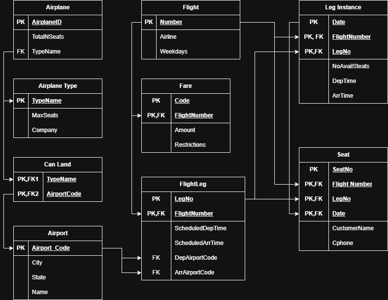
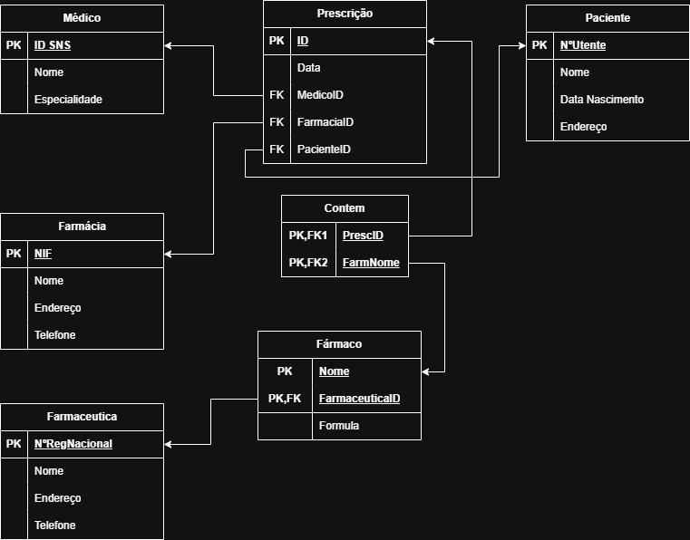
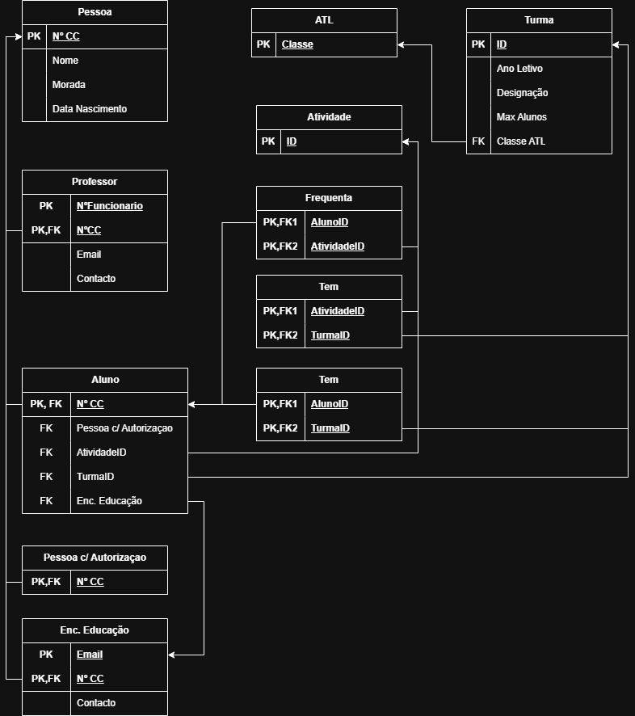

# BD: Guião 3


## ​Problema 3.1
 
### *a)*

```
Tabelas              (PK,                                   *atributos*,                          FK)

    Cliente          (NIF,                                  Nome, Endereco, Telefone)

    Balcao           (Num_balcao,                           Endereco, Nome)

    Aluguer          (Num_Aluguer,                          Duração, Data,                        Num_balcao, NIF, Veiculo)

    Veiculo          (Matricula,                            Marca, Ano                            TipoVeiculo)

    Tipo de Veiculo  (Codigo,                               AC, Designaçao)

    Similaridade     (Codigo Veiculo, Similiar,                                                   Codigo Veiculo, Similiar)

    Ligeiro          (Categ_Ligeiro,                        NumLugares, Portas, Combustivel,      TipoVeiculo, Categ_ligeiro)

    Pesado           (Categ_Pesado,                         Peso, Passageiros,                    Categ_Pesado)
```


### *b)* 

```
Cliente
    PK: NIF
    CK: NIF, NumCarta
    FK:

Balcao
    PK: Num_balcao
    CK: Num_balcao
    FK:

Aluguer
    PK: Num_aluguer
    CK: Num_aluguer
    FK: NIF                      --> Cliente(NIF)
        Local                    --> Balcao(Numero)
        Veiculo                  --> Veiculo(Matricula)

Veiculo
    PK: Matricula
    CK: Matricula
    FK: Tipo de Veiculo          --> Tipo de Veiculo(Codigo)

Tipo de Veiculo
    PK: Codigo
    CK: Codigo
    FK:

Similaridade
    PK: (CodigoVeiculo, Similar)
    CK: (CodigoVeiculo, Similar)
    FK: CodigoVeiculo                   --> TipoVeiculo(Codigo)
        Similar                         --> TipoVeiculo(Codigo)

Ligeiro
    PK: Catg_Ligeiro
    CK: Catg_Ligeiro
    FK: Catg_Ligeiro                    --> TipoVeiculo(Codigo)


Pesado
    PK: Catg_Pesado
    CK: Catg_Pesado
    FK: Catg_Pesado                    --> TipoVeiculo(Codigo)
```


### *c)* 


## ​Problema 3.2

### *a)*

```
Tabelas            (PK,                                   *atributos*,                          FK)

    Airport        (AirportCode,                          City, State, Name)

    AirplaneType   (TypeName,                             Company, MaxSeats)

    Flight         (Number,                               Airline, Weekdays)

    Airplane       (AirplaneID,                           TotalNSeats,                          TypeName)

    CanLand        (TypeName, AirportCode,                                                      TypeName, AirportCode)

    Fare           (FlightNumber, Code,                   Amount, Restrictions,                 FlightNumber)

    FlightLeg      (FlightNumber, LegNo,                  ScheduledDepTime, ScheduledArrTime,   FlightNumber, DepAirportCode, ArrAirportCode)

    LegInstance    (FlightNumber, LegNo, Date,            NoAvailSeats, DepTime, ArrTime,       FlightNumber, LegNo, AirplaneID, DepAirportCode, ArrAirportCode)

    Seat           (FlightNumber, LegNo, Date, SeatNo,    CustomerName, Cphone,                 FlightNumber, LegNo, Date)

```


### *b)* 

```
Airport
    PK AirportCode
    CK: AirportCode, Name
    FK:

AirplaneType
    PK: TypeName
    CK: TypeName
    FK:

Flight
    PK: Number
    CK: Number
    FK:

Airplane
    PK: AirplaneID
    CK: AirplaneID
    FK: TypeName    --> AirplaneType(TypeName)

CanLand
    PK: (TypeName, AirportCode)
    CK: (TypeName, AirportCode)
    FK: TypeName        --> AirplaneType(TypeName)
        AirportCode     --> Airport(AirportCode)

Fare
    PK: (FlightNumber, Code)
    CK: (FlightNumber, Code)
    FK: FlightNumber    --> Flight(Number)

FlightLeg
    PK: (FlightNumber, LegNo)
    CK: (FlightNumber, LegNo)
    FK: FlightNumber        --> Flight(Number)
        DepAirportCode      --> Airport(AirportCode)
        ArrAirportCode      --> Airport(AirportCode)

LegInstance
    PK: (FlightNumber, LegNo, Date)
    CK: (FlightNumber, LegNo, Date)
    FK: (FlightNumber, LegNo)   --> FlightLeg(FlightNumber, LegNo)
        AirplaneID              --> Airplane(AirplaneID)
        DepAirportCode          --> Airport(AirportCode)
        ArrAirportCode          --> Airport(AirportCode)

Seat
    PK: (FlightNumber, LegNo, Date, SeatNo)
    CK: (FlightNumber, LegNo, Date, SeatNo)
    FK: (FlightNumber, LegNo, Date)         --> LegInstance(FlightNumber, LegNo, Date)
```


### *c)* 




## ​Problema 3.3


### *a)* 2.1


### *b)* 2.2



### *c)* 2.3


### *d)* 2.4

